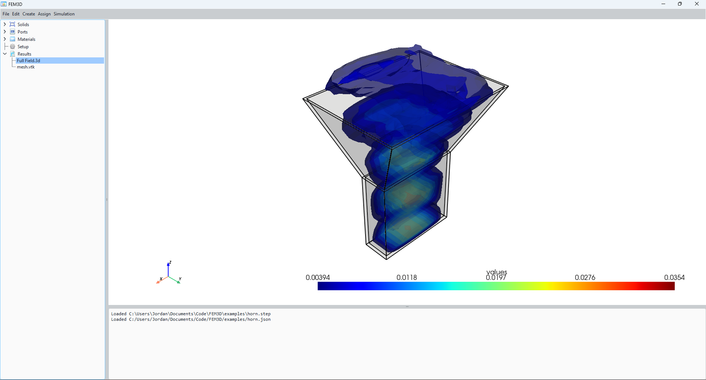

## About
A 3d electromagnetic field solver in c++. Supports importing step files, setting materials, running simulations and visualizing results. Currently a work in progress.

## Examples

## Icons
https://p.yusukekamiyamane.com/
