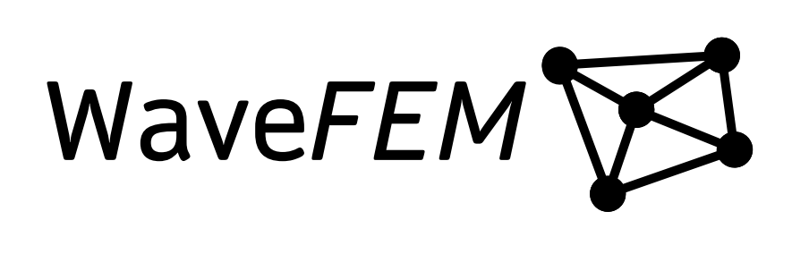

## About
A 3d electromagnetic field solver in C++ with a Python frontend. Supports importing step files, setting materials, running simulations and visualizing results.

## Examples
Simulations of some basic geometries compared against HFSS.

### Horn Antenna
 

### Waveguide with Dialectric Cross Section
 

### Waveguide with Dialectric Obstacle
 

### Ridged Waveguide Port
 

## Acknowledgements 

### Libraries
GMSH - https://gmsh.info/

Pyvista - https://pyvista.org/

CadQuery - https://github.com/CadQuery/cadquery

Eigen - https://eigen.tuxfamily.org/index.php?title=Main_Page

PyQT - https://doc.qt.io/qtforpython-6/

### Icons
https://p.yusukekamiyamane.com/
